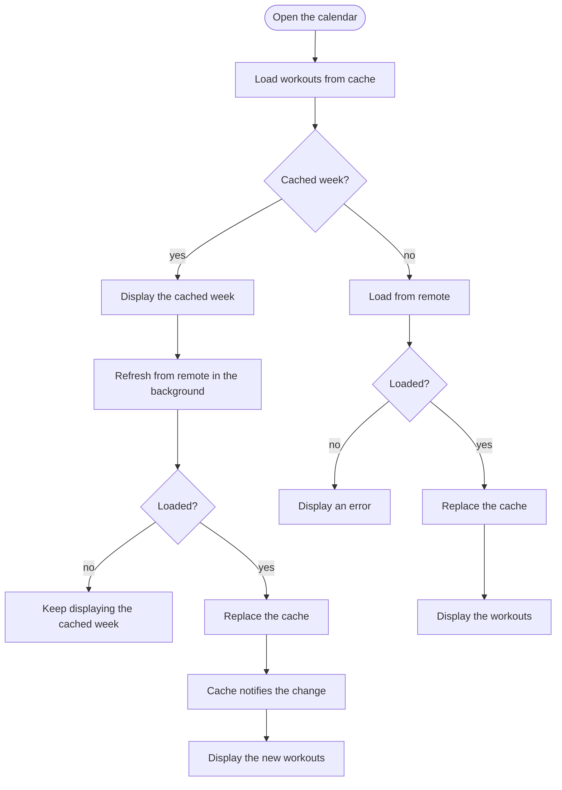
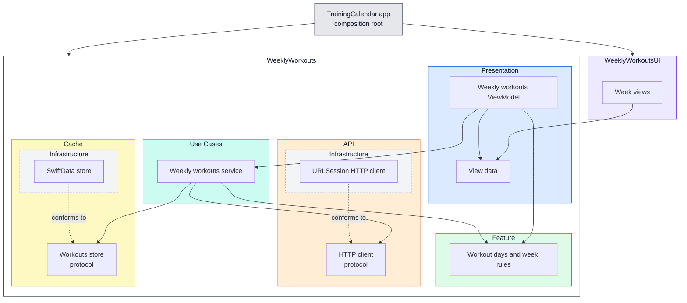

# Training Calendar

A weekly training calendar for iOS: it shows the current week's workouts (Monday to Sunday) with their status, and lets the user mark workouts as completed locally. Data comes from a mock API and is cached so the app opens instantly with the last known week.

## Video Walkthrough

Coming soon: the link will be added here.

## Build & Run

**Requirements:** Xcode 27, iOS 17+ simulator or device.

**Run the app**
1. Open `TrainingCalendar/TrainingCalendar.xcodeproj`.
2. Select the `TrainingCalendar` scheme and an iPhone simulator.
3. Run (⌘R). The app loads the week from `https://mock.internalef.com/workouts` and caches it; relaunch offline to see the cached week.

**Run the tests**

The feature logic has no UI dependency, so its tests run on macOS without a simulator. Either:

- **Xcode:** in `TrainingCalendar/TrainingCalendar.xcodeproj`, select the `WeeklyWorkouts` scheme with **My Mac** (or any iPhone simulator) as the destination, and press ⌘U.
- **Terminal:**

  ```sh
  cd WeeklyWorkouts
  swift test
  ```

**Project layout**
- `WeeklyWorkouts/` — Swift package: the `WeeklyWorkouts` target (models, API, cache, rules, ViewModel) and the `WeeklyWorkoutsUI` target (SwiftUI views).
- `TrainingCalendar/` — the iOS app: composition root only.

Inside the `WeeklyWorkouts` target, code is grouped by capability: `Weekly Workouts Feature` (the models and their rules), `Weekly Workouts Use Cases` (`WeeklyWorkoutsService`, one extension per use case), `Weekly Workouts API`, `Weekly Workouts Cache` and `Weekly Workouts Presentation`. Each concrete adapter (the URLSession client, the SwiftData store) sits in an `Infrastructure` folder inside its capability.

## Feature Specs

### Story: Customer requests to see this week's workouts

### Narrative #1

```
As an online customer
I want the app to automatically load my latest weekly workouts
So I can always see what I need to train this week
```

#### Scenarios (Acceptance criteria)

```
Given the customer has connectivity
  And the cache is empty
 When the customer opens the Training Calendar
 Then the app should display the latest workouts from remote
  And save them to the cache

Given the customer has connectivity
  And there's a cached version of the current week
 When the customer opens the Training Calendar
 Then the app should display the cached workouts
  And fetch the latest workouts from remote
  And replace the cache with the new workouts and display them
```

### Narrative #2

```
As an offline customer
I want the app to show the latest saved version of my weekly workouts
So I can still see my plan without a connection
```

#### Scenarios (Acceptance criteria)

```
Given the customer doesn't have connectivity
  And there's a cached version of the workouts
  And the cache belongs to the current week
 When the customer opens the Training Calendar
 Then the app should display the cached workouts

Given the customer doesn't have connectivity
  And the cache belongs to a previous week
 When the customer opens the Training Calendar
 Then the app should display the 7 empty day cells of the current week
  And display an error message

Given the customer doesn't have connectivity
  And the cache is empty
 When the customer opens the Training Calendar
 Then the app should display the 7 empty day cells of the current week
  And display an error message
```

### Narrative #3

```
As a customer
I want to see the status of each workout this week
So I know what I have done, what I missed and what is still ahead
```

#### Scenarios (Acceptance criteria)

```
Given a workout on a day before today
 When the customer views the week
 Then it should show Completed if completed, otherwise Missed

Given a workout today
 When the customer views the week
 Then it should show Completed if completed, otherwise Assigned

Given a workout on a day after today
 When the customer views the week
 Then it should show as upcoming, with no status
```

### Story: Customer marks a workout as completed

### Narrative #4

```
As a customer
I want to mark a workout as completed
So I can track what I have done this week
```

#### Scenarios (Acceptance criteria)

```
Given a workout that is not completed
 When the customer marks the workout as completed
 Then the workout should be shown as completed
  And it should stay completed after a refresh or when the app is reopened

Given a workout that is completed
 When the customer unmarks the workout
 Then the workout should no longer be shown as completed
  And its status should fall back to Missed (past), Assigned (today) or upcoming (future)
```

## Use Cases

### Load Weekly Workouts Use Case

#### Data:
- URL

#### Primary course (cached week):
1. Execute "Load Weekly Workouts" command with above data.
2. System loads the workouts from cache.
3. System applies the completion marks to the cached workouts.
4. System delivers the weekly workouts.
5. System refreshes the workouts from remote in the background.

#### No cached week course (the cache is empty, from a previous week or can't be read):
1. System downloads data from the URL.
2. System validates downloaded data.
3. System creates weekly workouts from valid data.
4. System replaces the cache with the weekly workouts, without the completion marks.
5. System applies the completion marks to the weekly workouts.
6. System delivers the weekly workouts.

#### Needs loading course:
1. System loads the workouts from cache.
2. System delivers whether there's no cached week for the current week, without loading from remote or writing to the cache.

#### Refresh from remote course:
1. System downloads data from the URL.
2. System validates downloaded data.
3. System creates weekly workouts from valid data.
4. System replaces the cache with the weekly workouts, without the completion marks. The cache notifies the change.

#### Apply completion marks course:
1. System retrieves the completion marks.
2. For each workout with a mark, System sets whether it's completed as the mark says, whatever the server status.
3. Workouts without a mark keep the server's completion.
4. System ignores marks for workouts that aren't in the week.

#### Failed refresh course (cached week):
1. System keeps the cache and delivers no error.

#### Invalid data – error course (no cached week):
1. System delivers invalid data error.

#### Request failure – error course (no cached week):
1. System delivers request failure error.

#### Cancel course (no cached week):
1. System delivers a cancellation error.

#### Saving error course:
1. System still delivers the weekly workouts.

#### Marks retrieval error course (sad path):
1. System delivers error. With a cached week, no refresh starts.

---

### Reload Cached Weekly Workouts Use Case

#### Primary course:
1. Execute "Reload Cached Weekly Workouts" command, when the cache notifies a change.
2. System loads the workouts from cache.
3. System applies the completion marks to the cached workouts.
4. System delivers the weekly workouts, without loading from remote.

#### Retrieval error course (sad path):
1. System delivers error.

---

### Load Workouts From Cache Use Case

#### Primary course:
1. Execute "Load Workouts" command.
2. System retrieves workouts data from cache.
3. System validates the cache was saved in the current week (Mon–Sun).
4. System creates weekly workouts from cached data.
5. System delivers weekly workouts.

#### Retrieval error course (sad path):
1. System delivers error.

#### Cache from a previous week course (sad path):
1. System delivers no workouts.

#### Empty cache course (sad path):
1. System delivers no workouts.

---

### Validate Workouts Cache Use Case

#### Primary course:
1. Execute "Validate Cache" command.
2. System retrieves workouts data from cache.
3. System validates the cache was saved in the current week.

#### Retrieval error course (sad path):
1. System delivers error. Nothing is deleted: the next successful remote load replaces the cache.

#### Cache from a previous week course (sad path):
1. System deletes the completion marks, then the cached workouts.

---

### Cache Workouts Use Case

#### Data:
- Weekly workouts

#### Primary course (happy path):
1. Execute "Save Workouts" command with above data.
2. System deletes old cache data.
3. System maps the weekly workouts to local cache models.
4. System timestamps the new cache.
5. System saves new cache data.
6. System delivers success message.

#### Deleting error course (sad path):
1. System delivers error.

#### Saving error course (sad path):
1. System delivers error.

---

### Toggle Workout Completion Use Case

#### Data:
- Workout ID
- Its current completion (the local mark if any, otherwise the server status)

#### Primary course (happy path):
1. Execute "Toggle Completion" command with above data.
2. System inverts the current completion.
3. System saves the inverted completion as the mark for the ID, replacing any previous mark.
4. System delivers the new completion.

#### Saving error course (sad path):
1. System keeps the previous mark.
2. System delivers error.

## Flowchart



## Model Specs

### Workout Day

| Property | Type |
| --- | --- |
| `id` | `String` |
| `day` | `Int` (0 = Monday … 6 = Sunday) |
| `workouts` | `[Workout]` |

### Workout

| Property | Type |
| --- | --- |
| `id` | `String` |
| `title` | `String` |
| `status` | `assigned` (0), `missed` (1) or `completed` (2) |
| `exerciseCount` | `Int` |

## Payload Contract

```
GET https://mock.internalef.com/workouts

200 RESPONSE

{
  "data": [
    {
      "_id": "68c0a1f45b9d4a0017c8e104",
      "day": 4,
      "assignments": [
        {
          "_id": "68c0a1f45b9d4a0017c8e204",
          "title": "Legs day",
          "status": 0,
          "total_exercise": 7
        },
        {
          "_id": "68c0a1f45b9d4a0017c8e205",
          "title": "HIIT Tabata 20:10 8x8",
          "status": 0,
          "total_exercise": 15
        }
      ]
    },
    {
      "_id": "68c0a1f45b9d4a0017c8e105",
      "day": 5,
      "assignments": []
    }
  ]
}
```

## Assumptions & Decisions

The brief and the mock API leave a few points open. These are the decisions taken and why.

| # | Open point | What I found | Decision |
| --- | --- | --- | --- |
| 1 | The brief lists two different endpoints | `https://mock.internalef.com/workouts` returns 200; `demo6732818.mockable.io/workouts` did not respond (checked Sep 26, 2026) | Use `mock.internalef.com`. The URL is set in the composition root |
| 2 | Is `day` 0 Monday or Sunday? | The payload has no real dates, only an index 0...6 | `day 0 = Monday`, matching the Mon–Sun week view, mapped onto the real dates of the current week |
| 3 | What do `status` 0/1/2 mean? | Not documented | Assume `0 = assigned`, `1 = missed`, `2 = completed`. The displayed status is **derived** from the day relative to today plus the completion flag, not shown raw |
| 4 | Are local completion marks overwritten by a newer fetch? | Not specified | No. Marks are stored separately by workout ID and applied on top of remote data — a local mark wins |
| 5 | Can future workouts be toggled? | The brief says tapping any non-empty cell toggles it. The design only shows a completed past workout | Yes, any workout can be toggled. A completed workout uses the completed style whatever its day, including an upcoming one |
| 6 | Which timezone defines "this week" and "today"? | Not specified | The device's timezone and calendar, with the week always starting on Monday (independent of locale) |
| 7 | "Fetching updates (if any)": should the app use `ETag`? | The brief doesn't say. The server supports `ETag` (verified), but it isn't a documented contract | Not handled: this use case doesn't need it, as the response is a single small week of data, and there is no one to confirm otherwise. Every load fetches the full response, replaces the cache and displays it; when nothing changed the screen looks the same, so no comparison is needed |
| 8 | Remote fetch fails while cached data is shown | Not specified | Keep the cached data and show no error — it is still valid for this week, and the next launch refetches |
| 9 | When does the cache expire? | The payload only describes "the current week" (index 0...6, no dates) | The cache is valid while it was saved in the same Mon–Sun week as now. From the next Monday it expires: workouts and completion marks are deleted (so stale marks can't apply if the server reuses IDs). Validity is re-checked when the app leaves the foreground, so an expired week is gone when it comes back; without a cached week for the current week, the week is then loaded again |
| 10 | What to show when loading fails and there is no valid cache | Neither the brief nor the design defines an error state | Show the empty week with the error alert (#16). No extra error UI is invented; loading is retried on the next launch or when the app returns to the foreground |
| 11 | What is the API contract? | There is no API documentation, only the mock endpoint's response. In the observed response (7 days, 6 workouts) every field is present and non-null, `status` is 0, 1 or 2, and `day` is 0...6 | The Payload Contract above is inferred from that response, not agreed with a backend team. All its fields are treated as required, and only a `200` response is treated as success. Decoding is strict: a response that doesn't match — including an unknown `status` or a `day` outside 0...6 — is an invalid data error for the whole week |
| 12 | How are loading errors classified? | The brief doesn't require any specific error handling | Three categories only: any failure to get a response (no network, timeout, TLS failure, a non-HTTP response) is a request failure; a response that can't be used is invalid data; a cancelled load delivers a cancellation error. Finer categories would be added only if the app had to handle them differently |
| 13 | Which persistence layer? | The brief allows any persistence layer | SwiftData, as an implementation detail behind the cache store protocol. The store notifies when the cached data changes; how it detects that is up to the implementation, and the use cases don't depend on it |
| 14 | What does loading look like? | The loading frame shows the 7 dates with empty rows; the brief asks for "an empty/loading state" | Each day shows its date and a shimmering placeholder card, so it's clear data is on its way. This is a deliberate difference from the loading frame |
| 15 | How is a single exercise written? | The design only shows plural counts | "1 exercise", otherwise "N exercises" |
| 16 | What does the error state look like? | Not in the design | A system alert when loading or saving a change fails; the week stays on screen behind it |
| 17 | Should validation delete a cache it can't read? | Not specified | No. A read can fail temporarily, and deleting would lose a good cache; a truly corrupt cache is replaced by the next successful remote load |
| 18 | What if saving the loaded week fails? | Not specified | The loaded week is still displayed: it is valid data, and failing to cache it doesn't make it wrong. The next load saves it again |

## Architecture



Solid arrows mean "depends on"; dotted arrows mean "conforms to". The whole app target is the composition root: it depends on both modules, creates the concrete types and wires them together. Inside the `WeeklyWorkouts` package, the service only knows the protocols of the API and the cache; each concrete adapter lives in its capability's `Infrastructure` folder. The views only read display data.

## AI Collaboration

### Tools
- **Claude Code** (Claude Opus 5.5) in the terminal: specs review, test lists, TDD implementation, pixel checks against the design.
- **Xcode**: building, running, SwiftUI previews and the final visual review.

### How I worked with AI
- **All the code is generated by Claude. I owned the decisions and the verification.**
  - I turned the brief into the specs, use cases and assumptions in this README.
  - I chose the architecture and resolved every ambiguity.
  - I approved or trimmed every test list before any code was written, so the tests encode my decisions.
  - I verified the result: the tests cover the specified behavior, the code follows the decisions above, the UI matches the design (measured), and the app runs as specified.
- **One prompt per use case, one pull request per use case.** Each prompt names the use case, its key rules and its scope.
- **Test list first, then TDD.** Claude built the tests one at a time: red, green, refactor. A test that passed on its first run was checked by breaking the code on purpose.
- **Spikes before big decisions.** When a design was unclear, Claude built a throwaway spike so I could compare real code and tests before choosing. Examples: how the loading service depends on the store, and which thread SwiftData actually runs on.
- **Generated logic is marked.** Non-trivial date and marks logic carries a `// Generated with Claude. Adjusted to handle …` comment: `MondayFirstWeek`, `WeekSchedule`, and the completion marks rule in `WorkoutDay` (`applying(_:)`).
- **What AI sped up most:** writing all the code and tests, and the pixel measurements. Pull requests were merged only after my review and go-ahead.

### Prompts

**1. Turning the brief into specs and assumptions**
```
Analyze the requirements in this brief and write the feature specs as BDD stories:
a narrative for each user goal, with scenarios as acceptance criteria, then the use
cases behind them.

Write them in README.md, in English, together with every point the brief or the
mock API leaves ambiguous and the decision taken for each, with the reason.
Leave the architecture out for now; I want to discuss it first.
```
**2. The calendar UI from the Figma design**
```
Start implementing the week calendar UI in WeeklyWorkoutsUI from the attached Figma
frames and CSS specs. Read the feature specs in README.md and CLAUDE.md first.

Key points of the UI:
- Match the design exactly: sizes, paddings, spacing, fonts, colors and title
  truncation come from the frames and specs, not from estimates.
- Sizes are proportional, not hard-coded: horizontal positions and widths follow the
  design's proportions of the screen width, and a row's height grows with its cards
  (a day can hold several workouts), with a minimum matching a one-card row.
- Each view takes a ViewData struct describing exactly what it shows (display-ready
  text, status, whether it's today) plus closures for actions. No ViewModel, no domain
  types, no colors in the ViewData — the view maps each status to its style. Keep
  colors and fonts in one place.
- While loading, every day shows its date and a shimmering placeholder card.
- Not shown in the design: a completed upcoming workout uses the completed style; one
  exercise reads "1 exercise"; the error state is a short one-line message in the
  design's secondary text style.
- Open Sans isn't a system font: add its font files to the target's resources and
  register them at runtime, otherwise SwiftUI silently falls back to the system font.

Before writing any code, list the components and their previews and verify them
yourself before showing them to me for approval:
- Does every state in the specs and the design have a preview?
- List any value you can't read exactly from the frames instead of guessing.

Scope: presentational views in a new WeeklyWorkoutsUI target only. The container view,
the ViewModel and the composition are later scopes.
```
*After measuring the renders against the design, I changed two decisions: plain point sizes (the design's 375pt values, with the card taking the remaining width) instead of screen proportions, and a system alert for errors. Formatting like "1 exercise" moved to the ViewModel.*

**3. The caching logic: when a cached week is still valid**
```
Start implementing the Load Workouts From Cache use case from README.md in a
`LocalWorkoutsLoader` conforming to `WorkoutsLoader` (`async throws`, single result).
Read the scenarios, the use case and CLAUDE.md first.

Key points of loading the cache:
- The cache is valid only if it was saved in the same Mon–Sun week as now, using the
  injected clock and calendar: saved Sunday night and read Monday morning is expired;
  a week spanning Dec 31 → Jan 2 is still one week.
- Load delivers the cached workouts if the cache is valid, no workouts if it's expired
  or empty, and the error if retrieval fails.
- Load only reads: it never deletes or modifies the cache, whether the cache is valid,
  expired, empty or fails to load. Deleting an expired cache is the Validate use
  case's job.

Before writing any code, list the test cases and verify them yourself before showing
them to me for approval:
- Do they cover the full system behavior defined in the specs?
- Are the edge cases and error paths complete?
- Be careful with side effects.

Scope: the use case component only, working against a workouts store protocol through
a test double, and tested through the use case. The concrete store, saving and
validating the cache are later scopes.
```
*Later, the loading was refactored into `WeeklyWorkoutsService`, and the `WorkoutsLoader` protocol went away. The week-validity rule and its tests stayed in `LocalWorkoutsLoader`.*

## My Development Process

1. **Clarify.** Turn the requirements into BDD scenarios and use cases; list every ambiguity with a decision and its reason, and confirm the open ones with product/design.
2. **Design.** Agree on boundaries, dependencies and data flow before code; keep the architecture as simple as the problem needs.
3. **Spike.** When a design choice or a framework's behavior is unclear, build a throwaway spike to see the real code, tests and measurements, then decide and discard it.
4. **Implement.** One use case per pull request:
   - list its tests first, one per behavior in the use case, and review the list;
   - then TDD: write one failing test, write the minimum code to pass it, refactor, and run the whole suite at every step;
   - for the UI, build the views against the design and measure them against it.
5. **Verify.** Run the full test suite and the app before merging, and check the result against the specs and assumptions.
