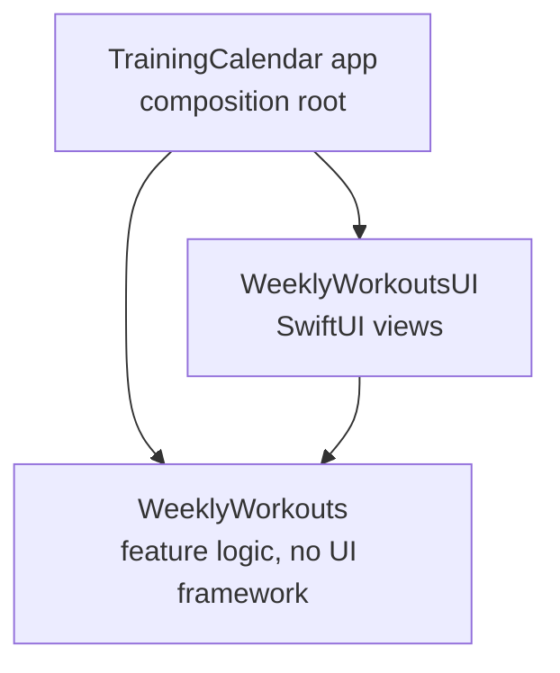

# Training Calendar

A weekly training calendar for iOS: it shows the current week's workouts (Monday to Sunday) with their status, and lets the user mark workouts as completed locally. Data comes from a mock API and is cached so the app opens instantly with the last known week.

## Feature Specs

### Story: Customer requests to see this week's workouts

### Narrative #1

```
As an online customer
I want the app to automatically load my latest weekly workouts
So I can always see what I need to train this week
```

#### Scenarios (Acceptance criteria)

```
Given the customer has connectivity
  And the cache is empty
 When the customer opens the Training Calendar
 Then the app should display the latest workouts from remote
  And save them to the cache

Given the customer has connectivity
  And there's a cached version of the current week
 When the customer opens the Training Calendar
 Then the app should display the cached workouts
  And fetch the latest workouts from remote
  And update the displayed workouts when remote data differs
  And replace the cache with the new workouts
```

### Narrative #2

```
As an offline customer
I want the app to show the latest saved version of my weekly workouts
So I can still see my plan without a connection
```

#### Scenarios (Acceptance criteria)

```
Given the customer doesn't have connectivity
  And there's a cached version of the workouts
  And the cache belongs to the current week
 When the customer opens the Training Calendar
 Then the app should display the cached workouts

Given the customer doesn't have connectivity
  And the cache belongs to a previous week
 When the customer opens the Training Calendar
 Then the app should display the 7 empty day cells of the current week
  And display an error message

Given the customer doesn't have connectivity
  And the cache is empty
 When the customer opens the Training Calendar
 Then the app should display the 7 empty day cells of the current week
  And display an error message
```

### Narrative #3

```
As a customer
I want to see the status of each workout this week
So I know what I have done, what I missed and what is still ahead
```

#### Scenarios (Acceptance criteria)

```
Given a workout on a day before today
 When the customer views the week
 Then it should show Completed if completed, otherwise Missed

Given a workout today
 When the customer views the week
 Then it should show Completed if completed, otherwise Assigned

Given a workout on a day after today
 When the customer views the week
 Then it should show as upcoming, with no status
```

### Story: Customer marks a workout as completed

### Narrative #4

```
As a customer
I want to mark a workout as completed
So I can track what I have done this week
```

#### Scenarios (Acceptance criteria)

```
Given a workout that is not completed
 When the customer marks the workout as completed
 Then the workout should be shown as completed
  And it should stay completed after a refresh or when the app is reopened

Given a workout that is completed
 When the customer unmarks the workout
 Then the workout should no longer be shown as completed
  And its status should fall back to Missed (past), Assigned (today) or upcoming (future)
```

## Use Cases

### Load Workouts From Remote Use Case

#### Data:
- URL

#### Primary course (happy path):
1. Execute "Load Workouts" command with above data.
2. System downloads data from the URL.
3. System validates downloaded data.
4. System creates weekly workouts from valid data.
5. System delivers weekly workouts.

#### Invalid data – error course (sad path):
1. System delivers invalid data error.

#### No connectivity – error course (sad path):
1. System delivers connectivity error.

---

### Load Workouts From Cache Use Case

#### Primary course:
1. Execute "Load Workouts" command.
2. System retrieves workouts data from cache.
3. System validates the cache was saved in the current week (Mon–Sun).
4. System creates weekly workouts from cached data.
5. System delivers weekly workouts.

#### Retrieval error course (sad path):
1. System delivers error.

#### Cache from a previous week course (sad path):
1. System delivers no workouts.

#### Empty cache course (sad path):
1. System delivers no workouts.

---

### Validate Workouts Cache Use Case

#### Primary course:
1. Execute "Validate Cache" command.
2. System retrieves workouts data from cache.
3. System validates the cache was saved in the current week.

#### Retrieval error course (sad path):
1. System deletes the cache.

#### Cache from a previous week course (sad path):
1. System deletes the cached workouts and completion marks.

---

### Cache Workouts Use Case

#### Data:
- Weekly workouts

#### Primary course (happy path):
1. Execute "Save Workouts" command with above data.
2. System deletes old cache data.
3. System encodes weekly workouts.
4. System timestamps the new cache.
5. System saves new cache data.
6. System delivers success message.

#### Deleting error course (sad path):
1. System delivers error.

#### Saving error course (sad path):
1. System delivers error.

---

### Toggle Workout Completion Use Case

#### Data:
- Workout ID

#### Primary course (happy path):
1. Execute "Toggle Completion" command with above data.
2. System reads the current completion mark for the ID.
3. System saves the inverted mark locally.
4. System delivers the new mark.

#### Saving error course (sad path):
1. System keeps the previous mark.
2. System delivers error.

---

### Load Weekly Workouts Use Case (cache first, then remote)

#### Primary course (happy path):
1. Execute "Load Weekly Workouts" command.
2. System loads workouts from cache (Load Workouts From Cache).
3. System applies local completion marks (a local mark wins over the server status) and delivers the cached workouts.
4. System loads workouts from remote (Load Workouts From Remote).
5. System caches the new workouts (Cache Workouts).
6. System applies local completion marks and delivers the new workouts only if they differ from the delivered ones.

#### Remote error after cached delivery course (sad path):
1. System finishes without error.

#### Remote error with nothing delivered course (sad path):
1. System delivers error.

## Assumptions & Decisions

The brief and the mock API leave a few points open. These are the decisions taken and why.

| # | Open point | What I found | Decision |
| --- | --- | --- | --- |
| 1 | The brief lists two different endpoints | `https://mock.internalef.com/workouts` returns 200; `demo6732818.mockable.io/workouts` did not respond (checked Sep 26, 2026) | Use `mock.internalef.com`. Keep the base URL in configuration and ship a mock JSON file in the repo for tests and previews |
| 2 | Is `day` 0 Monday or Sunday? | The payload has no real dates, only an index 0...6 | `day 0 = Monday`, matching the Mon–Sun week view, mapped onto the real dates of the current week |
| 3 | What do `status` 0/1/2 mean? | Not documented | Assume `0 = assigned`, `1 = missed`, `2 = completed`. The displayed status is **derived** from the day relative to today plus the completion flag, not shown raw |
| 4 | Are local completion marks overwritten by a newer fetch? | Not specified | No. Marks are stored separately by workout ID and applied on top of remote data — a local mark wins |
| 5 | Can future workouts be toggled? | The brief says tapping any non-empty cell toggles it | Yes, any workout can be toggled. A completed future workout shows the checkmark but keeps the greyed-out style |
| 6 | Which timezone defines "this week" and "today"? | Not specified | The device's timezone and calendar, with the week always starting on Monday (independent of locale) |
| 7 | "Fetching updates (if any)": should the app use `ETag`? | The brief doesn't say. The server supports `ETag` (verified), but it isn't a documented contract | Not handled: this use case doesn't need it, as the response is a single small week of data, and there is no one to confirm otherwise. Every load fetches the full response and the screen updates only if the data changed |
| 8 | Remote fetch fails while cached data is shown | Not specified | Keep the cached data and show no error — it is still valid for this week, and the next launch or foreground refetches |
| 9 | When does the cache expire? | The payload only describes "the current week" (index 0...6, no dates) | The cache is valid while it was saved in the same Mon–Sun week as now. From the next Monday it expires: workouts and completion marks are deleted (so stale marks can't apply if the server reuses IDs). Validity is re-checked when the app returns to the foreground |
| 10 | What to show when loading fails and there is no valid cache | Neither the brief nor the design defines an error state | Show the empty week with a short error message. No extra error UI is invented; loading is retried on the next launch or when the app returns to the foreground |

## Architecture



Arrows mean "depends on". The internal structure of `WeeklyWorkouts` emerges through TDD; this diagram is updated as it does.
